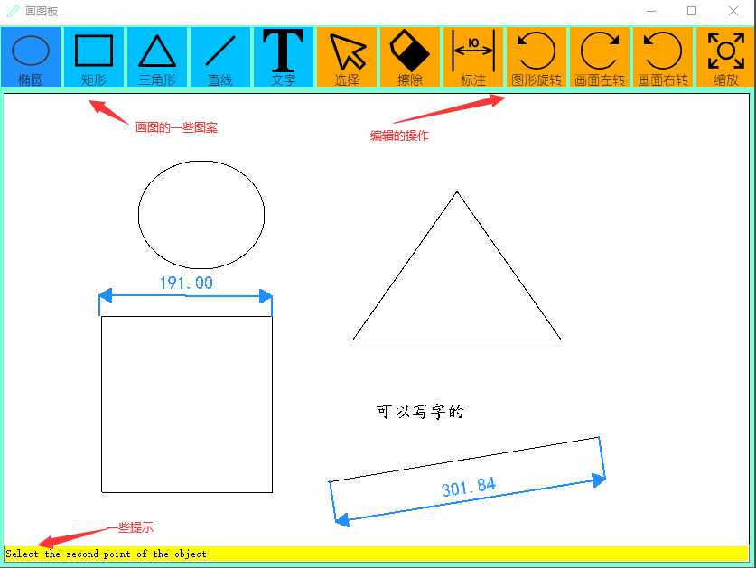

# 基于Qt中QOpenGLWidget模块实现的画图板

## 一、系统概述

- 本系统拟完成一个画图板，对多种常见图形进行基本操作
- 系统功能
  - **二维图形的输入**：可输入或全部清除直线、矩形、圆、椭圆、多边形、文本等
  - **二维图形的变换**：在直线、矩形、圆、椭圆、多边形、曲线内部可通过鼠标拖拽进行平移，通过按钮进行左右旋转和翻转，目前在直线上实现了图形旋转指点角度和基点等操作，其余图元重写相关函数即可
  - **二维图形的标注**：目前在直线上实现了标注，其它的图形的标注同理，直接重写相关函数即可
  - **文本的编辑**：通过鼠标双击实现文本的编辑；
- 环境说明
  - **IDE**：Qt Creator 9.0.2 (Community)
  - **Qt版本**：Qt 5.15.2
  - **开发语言**：C/C++

## 二、整体效果

## 三、主要设计思路

- 通过CDrawBodrdWidget创建主控制面板，这里使用单例模式，保证不重复创建
- 在systemdata中使用了工厂模式，对不同的图元进行处理
- shapeData是所有图元的基类，通过不断重写来实现图元的不同特性

## 四、可完善地方

- 重写除直线外的其它图元的方法，来实现所有图元的功能
- 完善菜单栏和工具栏
- 图元绘制好后的保存
- 图元各种参数的设置，比如图形的颜色、是否填充、线条的粗细等等
- 还有很多地方值得深入思考，时间紧迫，各位可以自己发掘。。。

## 五、参考资料

视频资料：

- [使用Qt和C++做一个简单的画图板--第一期_哔哩哔哩_bilibili](https://www.bilibili.com/video/BV1yM411c7xN/?spm_id_from=333.337.search-card.all.click)
- [使用Qt和C++做一个简单的画图板--第二期_哔哩哔哩_bilibili](https://www.bilibili.com/video/BV1Xy4y1d7yE/?spm_id_from=333.337.search-card.all.click&vd_source=ee136cfb2d0a04d50f65098cbe5523ef)

项目资料：

​	项目资料都在《参考资料》文件夹里，主要参考这两个进行了一定改进

网页资料：

​	在项目了的注释部分有网页资料的参考链接。

## 六、各位觉得有帮助，帮忙点个**star**，非常感谢。后续有时间继续改进。

